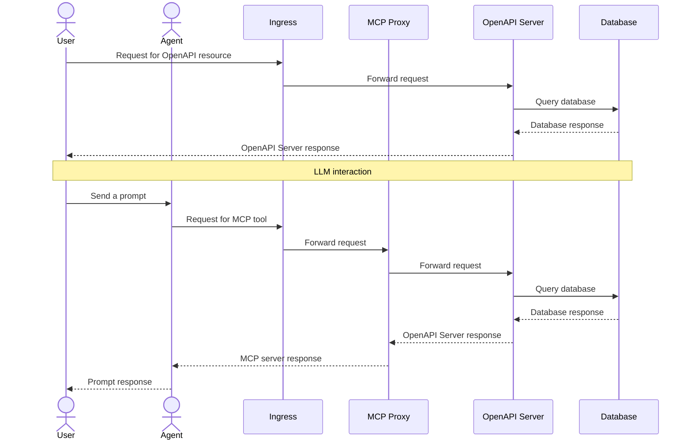

# MCP OpenAPI

<!-- markdown-link-check-disable-next-line -->

[](https://opensource.org/licenses/Apache-2.0)
[](https://github.com/marketplace/actions/super-linter)
[](https://github.com/rubocop/rubocop)

<!-- markdown-link-check-disable-next-line -->


[](https://github.com/boyter/scc/)
[](https://github.com/boyter/scc/)

This project aims to accelerate the adoption of the MCP protocol by simplifying server generation through automated tooling.
It parses an OpenAPI specification and dynamically generates the corresponding MCP server components.

## Key Features

- Parses OpenAPI specifications
- Dynamically generates MCP-compatible server code and tools
- Designed to streamline integration and deployment

## Use Cases

One common use case is deploying this application as a sidecar alongside existing services.
This enables seamless MCP support without requiring manual server implementation.

## Why MCP OpenAPI Proxy?

By automating the translation from OpenAPI to MCP, this tool reduces the overhead of manual server development
and promotes faster adoption of the MCP protocol within modern service architectures.

## Workflow



## Environment variables

| Name             | Default         | Description                                                  |
| ---------------- | --------------- | ------------------------------------------------------------ |
| OPENAPI_SPEC_URL |                 | URL of the Open API specification.                           |
| TRANSPORT        | streamable-http | Transport type to use for communication with the MCP server. |
| HOST             | 127.0.0.1       | Hostname or IP address to bind the server to.                |
| PORT             | 8000            | Port number to listen on.                                    |

## Validation

A [helper script](tests/client.py) is provided to validate the MCP server.
It uses the MCP Python SDK to connect, list tools, and execute them.

### List available tools

```bash
./tests/client.py -m http://localhost:8000/mcp
```

Example output:

```json
{
  "properties": {
    "url": {
      "title": "Url",
      "type": "string"
    }
  },
  "required": ["url"],
  "title": "fetch_websiteArguments",
  "type": "object"
}
```

### Call a tool

```bash
./tests/client.py -m http://localhost:8000/mcp -a call-tool -t fetch -i url=https://electrocucaracha.com/acerca/
```

Example output (truncated):

```html
<!DOCTYPE html>
<html lang="es">
  <head>
    <meta charset="UTF-8" />
    ...
  </head>
</html>
```
